# **PRACTICA 1**
# INTERCONEXIÓN DE EQUIPOS EN ESCRITORIOS VIRTUALES

## **Configuración del server de Ubuntu**

### *Cambio de hostname*
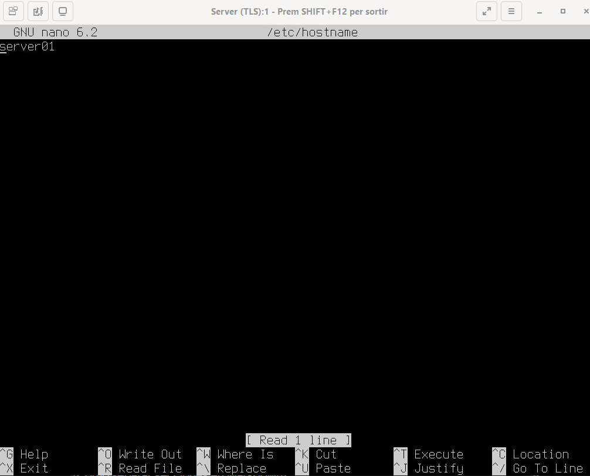

### *Configuración de tarjetas de red*
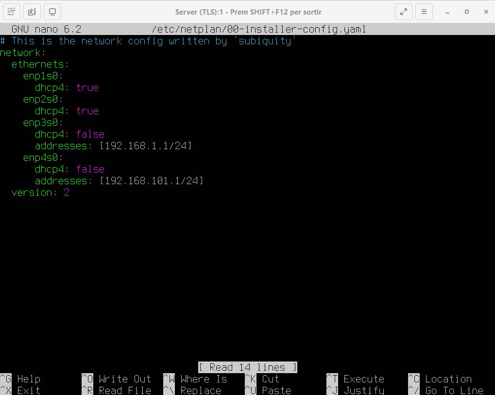

### *Comprobamos que se ha aplicacdo la configuración con el comando ip a*
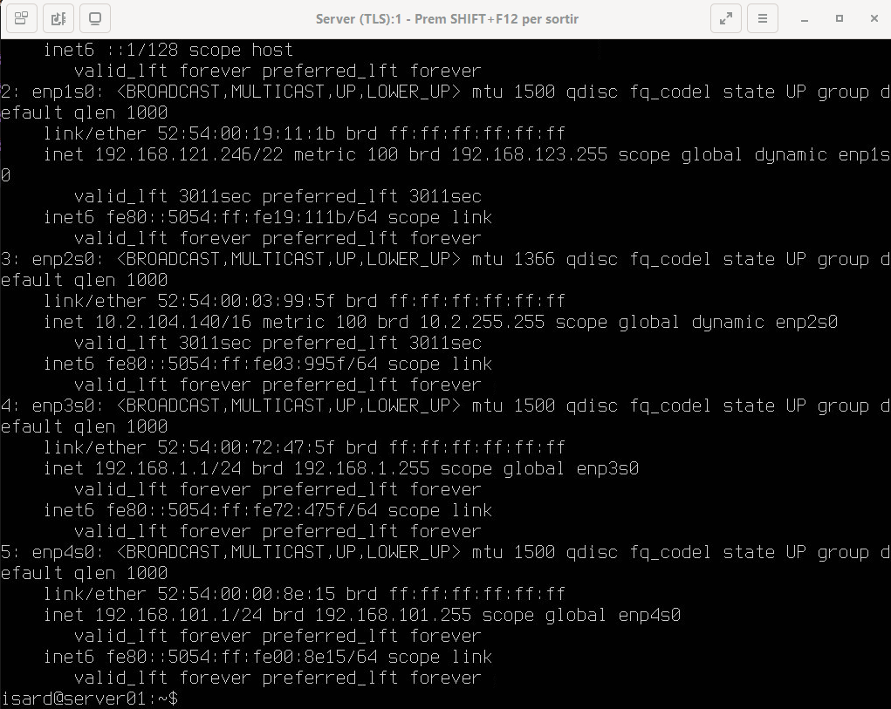

***
## **Configuración del cliente de Ubuntu**

### *Cambio de nombre de la máquina de Ubuntu*
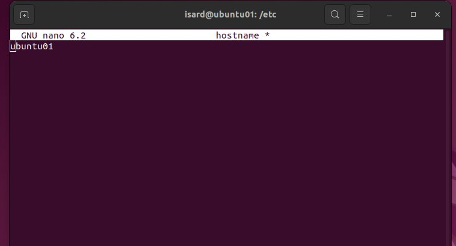

### *Configurar tarjeta de red en Ubuntu*
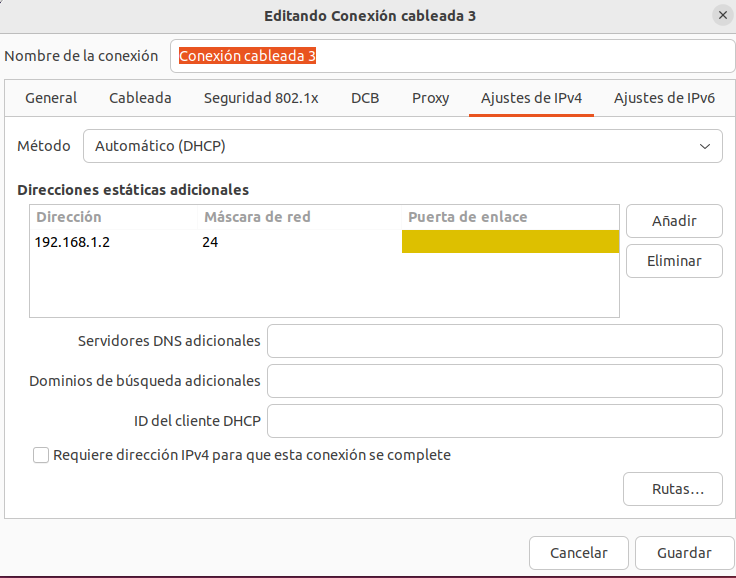

### *Comprobamos que la configuracion ha cambiado*
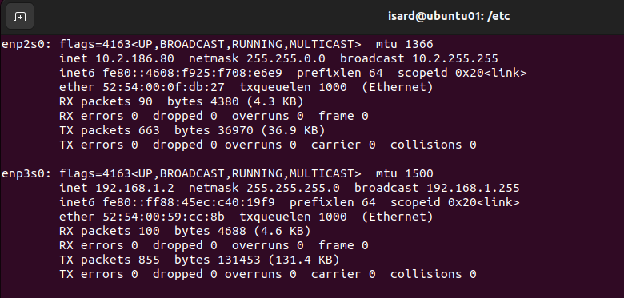

### *Hacemos ping al servidor*
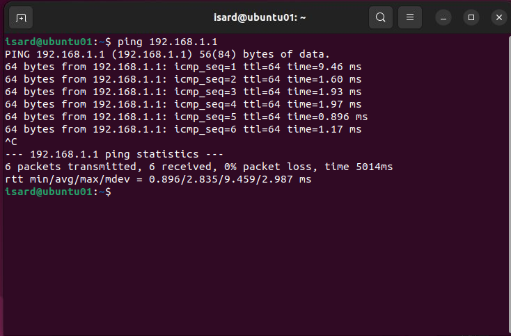

***
## **Configuración del cliente de Windows**

### *Cambiar nombre de la máquina*
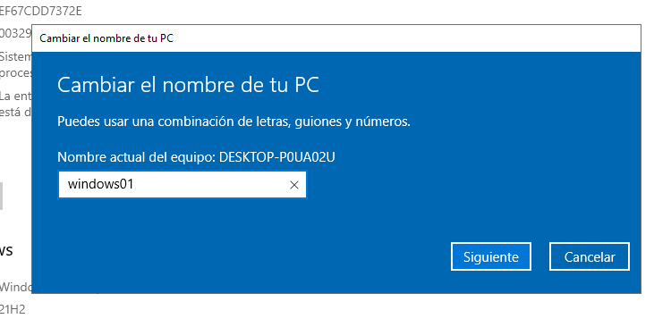

### *Configurar tarjeta de red en Windows*
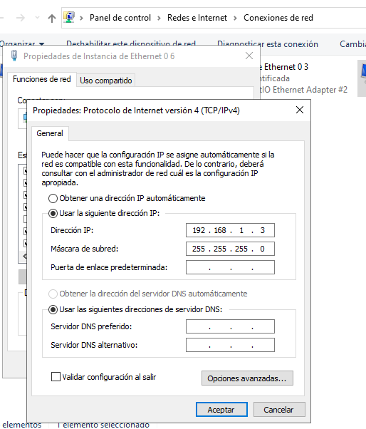

### *Comprobamos que la configuracion ha cambiado*
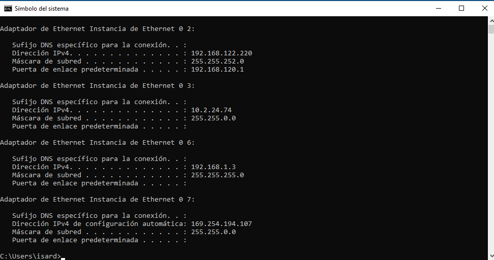

### *Hacemos ping al servidor y comprobamos que responde*
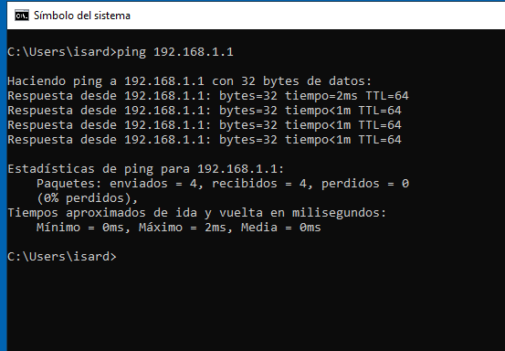

***
## **Configuración DHCP en Ubuntu Server**

### *Configuramos el servidor DHCP*
1. Añadimos la tarjeta de red al archivo 00-installer-config.yaml en la carpeta */etc/netplan* y ejecutamos el comando 
`sudo netplan apply`
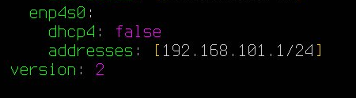

2. Instalamos el isc-shcp-server con el comando `sudo apt-get install isc-dhcp-server`

3. Añadimos el nombre de la tarjeta de red al archivo isc-dhcp-server en la carpeta */etc/default*

4. Establecemos el rango de ips en el archivo */etc/dhcp/dhcpd.conf*

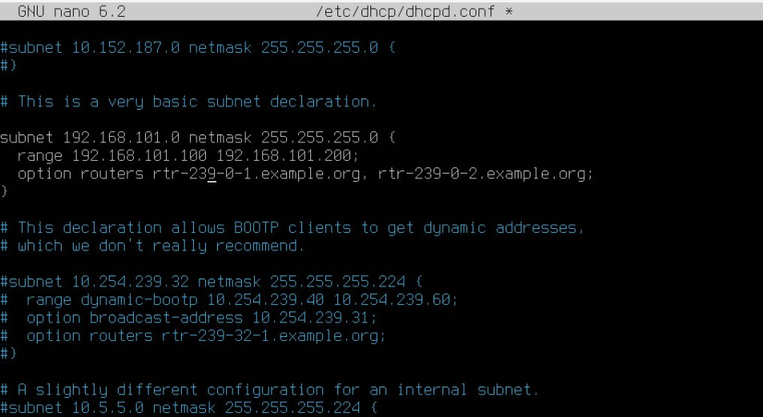

5. Hacemos un restart del servicio dhcp con el comando `sudo service isc-dhcp-server restart` y posteriormente comprobamos que funcione con el comando `sudo service isc-dhcp-server status`

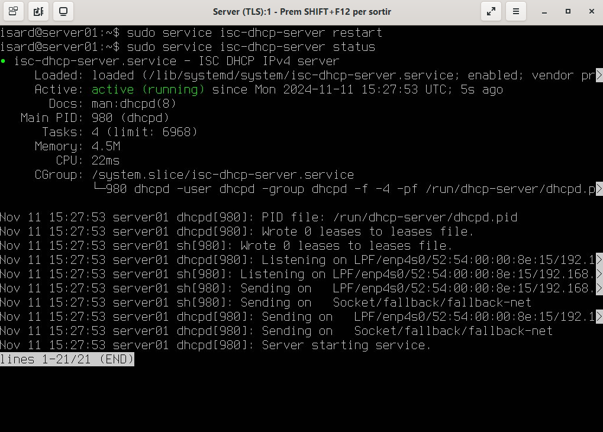

6. Hacemos ping desde el cliente de Ubuntu para comprobar que el servidor dhcp responde

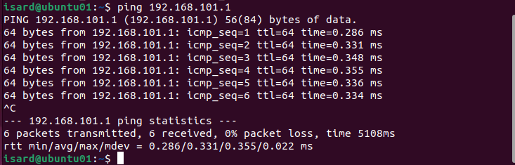

7. Hacemos ping desde el cliente de Windows para comprobar que el servidor dhcp responde

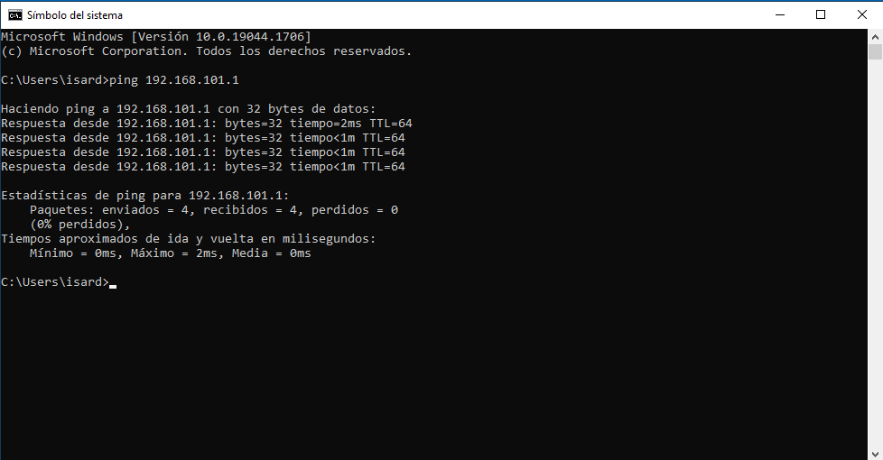

8. Verificamos los leases del servidor con el comando `dhcp-lease-list` y con `sudo nano /var/lib/dhcp/dhcpd.leases`

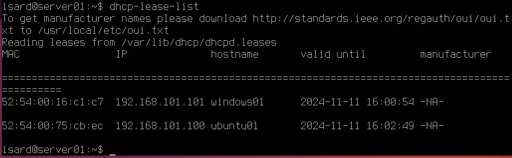

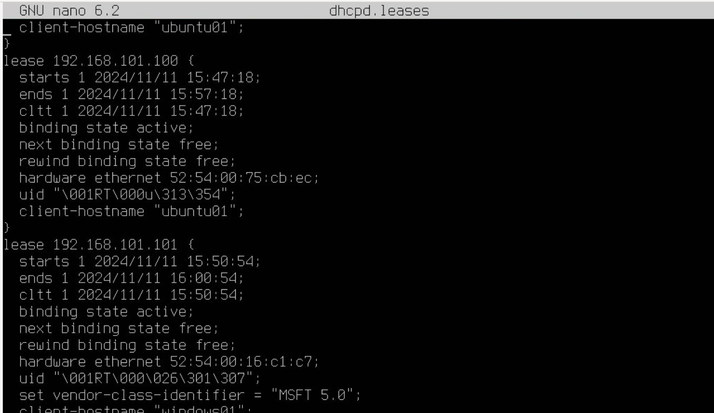

9. Reservamos una ip fija en el servidor DHCP

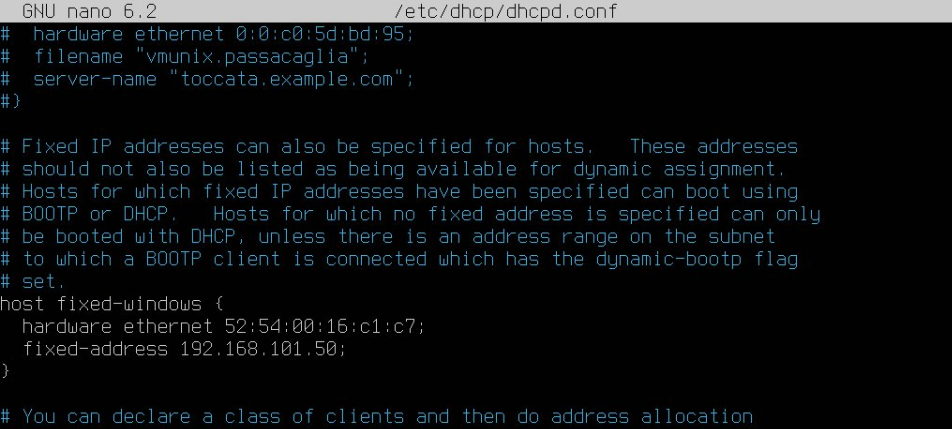

10. Comprobamos que se le asigna esa IP al cliente de Windows

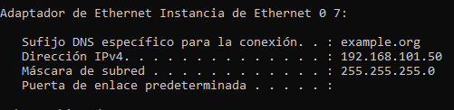