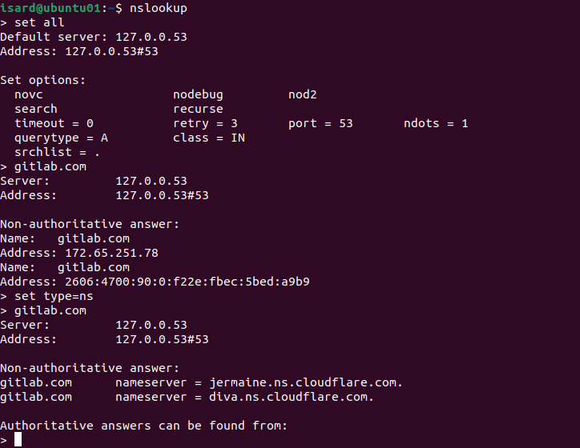

# Práctica 2. DNS

Servicio de DNS

## Objetivos

- Conocer el funcionamiento del servicio DNS
- Conocer los distintos registros asocidados a un dominio DNS.
- Conocer cómo suplantar el DNS de forma local.

## Qué entregar

- Toma el fichero markdown del repositorio del profesor y añádelo a tu repositorio de prácticas
- Añade los comentarios y fotos que expliquen y justifiquen tu trabajo.
- Vamos aprovechar esta práctica para aprender a añadir etiquetas en git:
  - https://git-scm.com/book/es/v2/Fundamentos-de-Git-Etiquetado
  - Definie una etiqueta P1 asocida al commit con el que terminas tu trabajo. Puedes hacerlo de una de estas maneras:
    - `git tag -a P2 <hash del commit>`
    - `git tag -a P2 -m 'Práctica 2 acabada'`
  - Sube tu trabajo y la etiqueta:
    - `git push origin P2`  //para subir la etiqueta
    - `git push origin --tags` //para subir todas las etiquetas
- Respeta la fecha de entrega.

### Herramientas de diagnóstico

- Toma un dominio público de acuerdo a tu número de alumno:
  1. **gitlab.com** --> _Se usará este dominio_
  2. bitbucket.com
  3. android.com
  4. trello.com
  5. atlassian.com
  6. ibercaja.es
  7. facebook.com
  8. twiter.com
  9. bbva.es
  10. instagram.com
  11. wikipedia.com
  12. elpais.com
  13. marca.com
  14. heraldo.es
  15. apple.com

- Intenta resolver las siguientes preguntas con con las 3 herramientas presentadas: host,nslookup y dig.
  - Busca la IP asignada
  
  > Para hacerlo he utilizado los comandos `nslookup` y `host` seguido de la dirección de la cual queremos saber la ip, en este caso `gitlab.com`

  - Quien resuelve su DNS
  
  >Obtenidos mediante el comando `host -t NS gitlab.com`
  - Cuál es el servidor de correo electrónico. Si hay varios, determina cual es primero por su prioridad.
  
  >Obtenido mediante el comando `host -t MX gitlab.com`. El servidor con mayor prioridad es el primero que aparace, `aspmx.l.google.com`.
  - Haz la búsqueda de forma autorizada, es decir, que el servidor que contesta sea uno de los registos NS del dominio.  
  
  >1. Obtenemos los servidores dns del dominio que estamos buscando para configurar uno de ellos como servidor por defecto.

  ***
  

  >2. Con el comando `server direccionServidor` establecemos como default el servidor que queremos utilizar.

  ***
  
  > 3. Buscamos otra vez la dirección `gitlab.com` y vemos que esta vez ya nos da los resultados de forma autorizada.

### Suplantar servicio DNS localmente.

- Edita el fichero `/etc/hosts` para que resuelva un nombre de dominio falso con el siguiente esquema: 
>Para ello utilizamos el comando `sudo nano /etc/hosts`
  - `miapellido.local` asociado a la dirección 127.0.0.1
  - `miapellido.es` asociado a una dirección pública inventada.
  - `miapellido.com` asociado a la dirección del dominio de la primera parte de la práctica. Si eres el nº 1 sería `github.com`

- Comprueba la resolución de los tres registros con alguna de las herramientas de diagnóstico.

- Comprueba la misma resolución pero haciendo que el servidor consultado sea el 8.8.8.8´

### Configuración del servidor  DNS con BIND9

- Configura el dominio `miapellido.edu` en bind9. Debes hacerlo:
  - En el servidor linux
  - Conectándote al mismo mediante SSH
  - Utiliza las direcciones IP de tu red privada (192.168.1xx.0/24)
  - Deberás usar un fichero con un nombre similar a este: *db.miapellido.edu*
- Debes definir:
  - Número de versión 1
  - Un correo de administrador dentro del dominio.
  - Dos registros MX.
  - Dos registros NS con máquinas del propio dominio (por ejemplo *dns1* y *dns2*).
  - Varios registros A, al menos: *www, dns1, dns2*
  - Un registro CNAME asociado a la misma dirección que *www*

> Instalamos BIND9 en el servidor Ubuntu:
>* Primero hacemos `sudo apt update && sudo apt ugrade -y`
>* Segundo, procedemos a intalar bind9 con este comando `sudo apt install bind9 bind9utils bind9-doc dnsutils -y`
>* Tercero, habilitamos e iniciamos el servicio de BIND9 con los comandos `sudo systemctl enable bind9` y
`sudo systemctl start bind9`
>* Verificamos que el servicio funciona con `sudo systemctl status bind9`
> 

***

> Accedemos al fichero *named.conf.local* con el comando `sudo nano /etc/bind/named.conf.local` y añadimos una zona con el nombre de nuestro archivo `.edu`
> 

***

>1. Creamos el archivo de zona con el comando `sudo cp /etc/bind/db.local /etc/bind/db.barcena.edu`
>2. Lo editamos con el comando `sudo nano /etc/bind/db.barcena.edu`
>

***

> A continuación configuramos las opciones globales con el comando `sudo nano /etc/bind/named.conf.options`
> 

- Para comprobar que tu configuración es correcta debes:
  - Usar el comando de verificación sintáctica.
  - Reiniciar el servicio
  - Probar la resolución usando nslookup y dig. Ojo, la resolución de nombres debe correr a cargo del servidor Ubuntu.

> Para comprobar que la configuración sea correcta seguimos estos pasos:
>* Verificamos que no nos dé ningún error el archivo de configuración principal al utilizar el comando `sudo named-checkconf`
>
>* Verificamos que el archivo de zona esté correctamente configurado con el comando `sudo named-checkzone example.com /etc/bind/db.barcena.edu`
>
>* Por último comprobamos la resolución DNS del servidor (por parte dle servidor) con el comando `dig @localhost barcena.edu`
>

- Trabajo extra. Para mejorar tu calificación se te propone:
  - Añadir una zona de resolución inversa
  - Instalar Bind9 en el cliente Ubuntu y definirlo como DNS esclavo del primero.